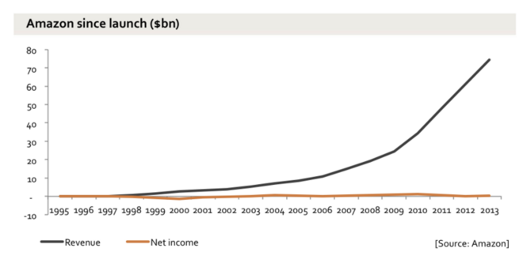
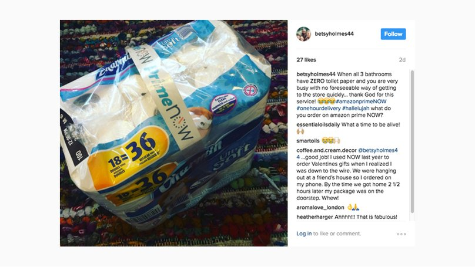
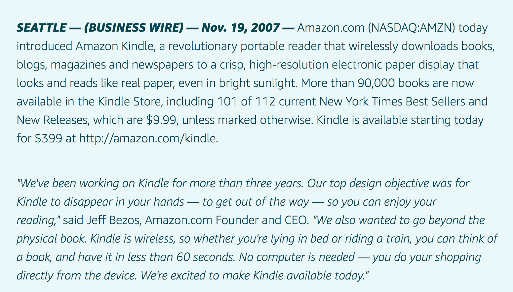
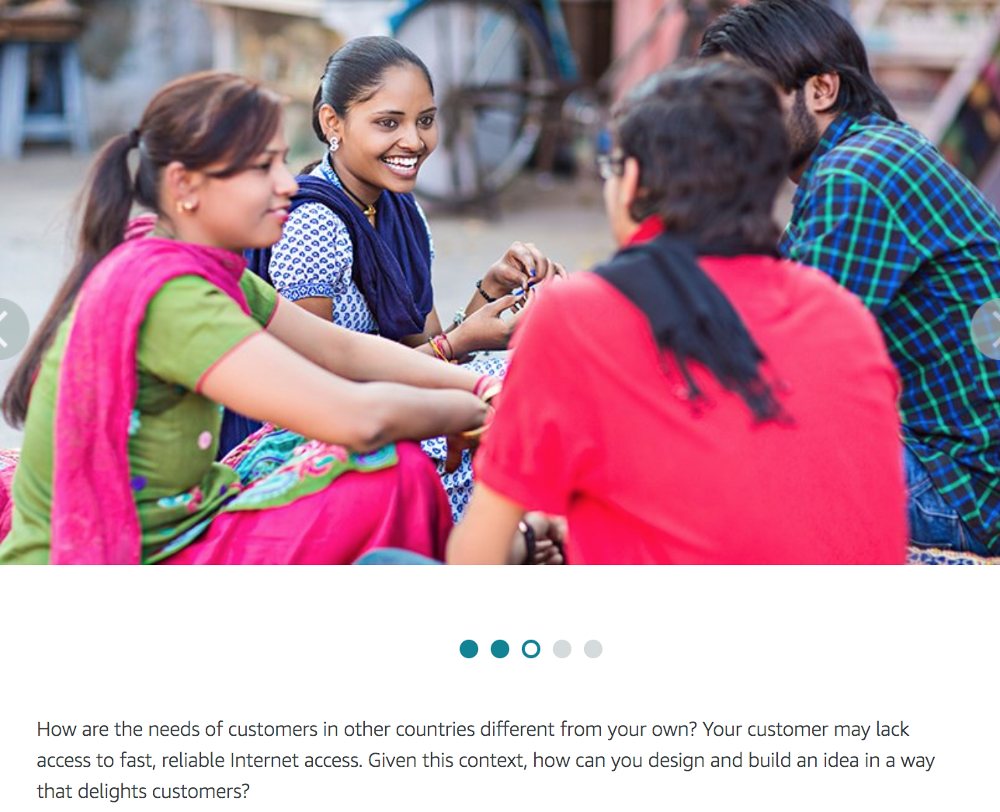
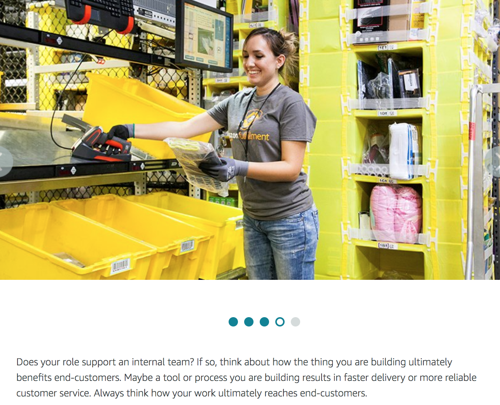
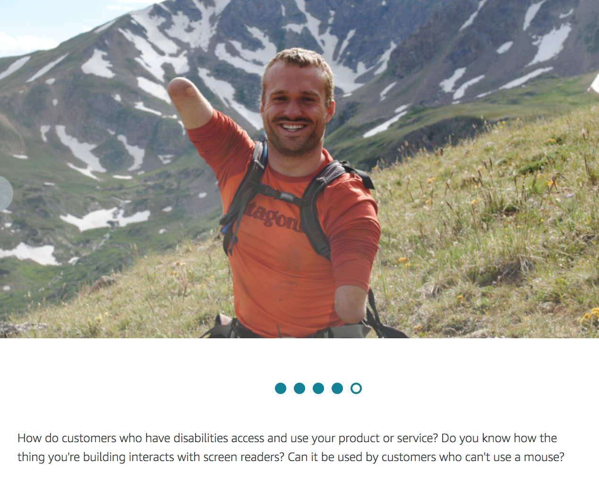

### Agenda
1. Amazon Business Overview
2. Working Backwards Training
3. Brainstorm
4. Storyboarding

  
#### IMPORTANT LINK: [bit.ly/NCCU-PV](https://bit.ly/NCCU-PV)
<small>*Everything you need for the next two weeks will be in this Google Drive folder*</small>

<aside class="notes"></aside>

---

### Amazon's Business Model 
#### The Amazon Flywheel

<!-- .element style="border: 0; background: None; box-shadow: None; width:70%" --> 

<aside class="notes">Has anyone seen this before? this is the original "amazon flywheel".. This business model is the Amazon flywheel, an economic engine that uses growth and massive scale to improve the customer experience through (again) greater selection and lower cost. Lower prices led to more customer visits. More customers increased the volume of sales and attracted more commission-paying third party sellers to the site. That allowed Amazon to get more out of fixed costs like the fulfillment centers and the servers they needed to run the website. This greater efficiency then enabled it to lower prices further. Feed any part of this flywheel… and it should accelerate the loop.</aside>

---

### How does this Flywheel work in action?
 
<!-- .element style="border: 0; background: None; box-shadow: None; width:70%" --> 

[PV Homepage Link](https://www.amazon.com/b/ref=lp_2858778011_nav_em_T1_0_4_5_1__aiv?rh=i%3Ainstant-video%2Cn%3A2858778011&ie=UTF8&node=2858778011)

<aside class="notes">I think it's easiest to break this down if we use the homepage. Prime Video consists of about 4 different businesses.</aside>

---

### How did we get here?
#### By Working Backwards

[Intro Video](https://workingbackwards.corp.amazon.com/core-training/introduction-working-backwards/)

---

### Jeff Bezos on Working Backwards

[Jeff Bezos on Working Backwards](https://workingbackwards.corp.amazon.com/core-training/introduction-working-backwards/why-working-backwards/)

---

### Customer Delight is the Ultimate Goal

<!-- .element style="border: 0; background: None; box-shadow: None; width:100%" --> 

--

### Customer Delight is the Ultimate Goal

<!-- .element style="border: 0; background: None; box-shadow: None; width:100%" --> 

---

### Customer Obsession

> The first sentence of our first leadership principle – customer obsession – states "Leaders start with the customer and work backwards."

<aside class="notes">As an Amazonian, you are expected and empowered to approach new opportunities by focusing on what customers need or want, regardless of whatever resources, budget, or time you may have. Early on, don’t limit ideas based to what you already know or what you think is possible. </aside>

---

### Kindle Example

<!-- .element style="border: 0; background: None; box-shadow: None; width:100%" --> 

---

### Who is your customer?

Hint: It's not **everyone** nor should it be!

**Dive Deeper** by thinking about your customer's motivations in a given context:
1. What is their situation?
2. What do they want or need?

ASk yourself, how does the time, place, and situation a customer is in affect their needs?

<aside class="notes">Think of a project you are working on now. Who is your customer? A typical response is everyone. While this may be true at a surface level, it doesn’t help you deeply understand your customer. Dive deeper by thinking about what a customer's motivations are in a given context. What is their situation? What do they want or need? Amazon has many types of customers. In addition to retail shoppers, Amazon serves businesses and their employees who purchase for work. With AWS, we serve cloud architects, developers, data analysts and scientists. We also serve advertisers and suppliers. All these people are in geographies all around the world and in different situations. In these examples, think about the context of the customer. Ask yourself, how does the time, place, and situation a customer is in affect their needs?</aside>

--

### Customer Examples 
<small>Amazon supports many types of customers. What unites all teams is a focus on benefiting end-customers.</small>

<!-- .element style="border: 0; background: None; box-shadow: None; width:100%" --> 
<aside class="notes">This woman is commuting on a bus. Think about her situation and how her needs or wants may be different in this context. Maybe she doesn’t want to use her voice to interact with her phone. Perhaps she is traveling through a part of town that has poor connectivity. Recognize that features which benefit a customer in one context may not apply in another.</aside>

--

### Customer Examples 

<!-- .element style="border: 0; background: None; box-shadow: None; width:100%" --> 
<aside class="notes">We serve people who work in businesses around the world who rely on our marketplace to have everything they need for work, as well as customers who have data and applications in the cloud and want to operate in the most smart and efficient manner for their business.</aside>

--

### Customer Examples 

<!-- .element style="border: 0; background: None; box-shadow: None; width:100%" --> 
<aside class="notes">How are the needs of customers in other countries different from your own? Your customer may lack access to fast, reliable Internet access. Given this context, how can you design and build an idea in a way that delights customers?</aside>

--

### Customer Examples 

<!-- .element style="border: 0; background: None; box-shadow: None; width:100%" --> 
<aside class="notes">Does your role support an internal team? If so, think about how the thing you are building ultimately benefits end-customers. Maybe a tool or process you are building results in faster delivery or more reliable customer service. Always think how your work ultimately reaches end-customers.</aside>

--

### Customer Examples 

<!-- .element style="border: 0; background: None; box-shadow: None; width:100%" --> 
<aside class="notes">How do customers who have disabilities access and use your product or service? Do you know how the thing you're building interacts with screen readers? Can it be used by customers who can't use a mouse?</aside>

---

### Needs vs Solutions 

Before building a solution, check to make sure it addresses a real customer need. But what is a need? It can be a tricky thing to define.

**Needs** are underlying functional or emotional circumstances, whereas **solutions** are the responses we build to resolve those circumstances.

**Solutions** must address a customer want or need -- so if we aren't clear on what they want or need, we risk wasting time and money creating solutions that don't delight the customer.

Be aware, customer needs may be expressed as aspirational wants or something intangible that customers desire. Needs may also be expressed as pain points - something a person does not like or wishes was better.

--

### Show Me the Data

Now that you understand the difference between customer needs and solutions. You'll want to find data to back up your assumptions, inform your new idea, validate existing customer problems, and increase your customer obsession.

---

### The Five Customer Questions

[Intro Video](https://workingbackwards.corp.amazon.com/core-training/introduction-working-backwards/5-customer-questions/)

