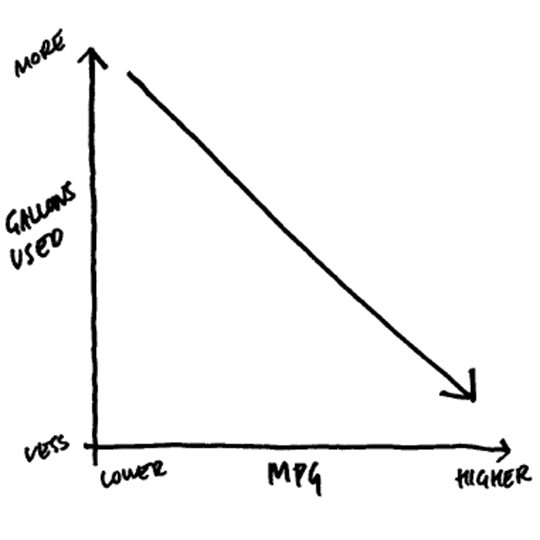
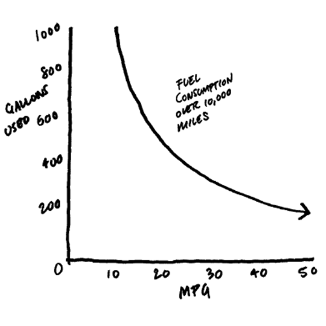
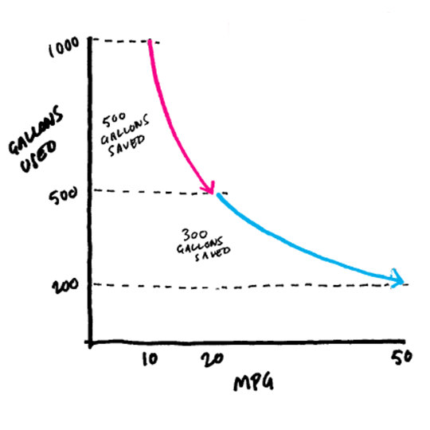
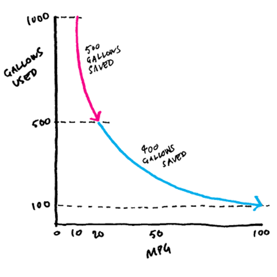
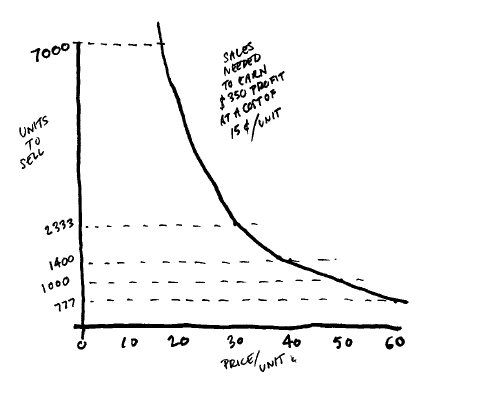
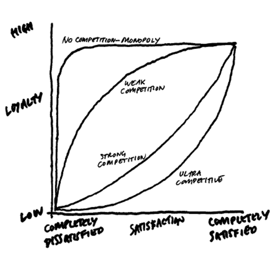
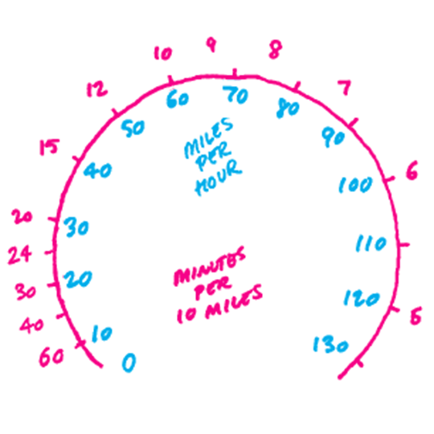

### Agenda
1. Linear Thinking in a Non-Linear World
2. Press Release Format

  
#### IMPORTANT LINK: [bit.ly/NCCU-PV](https://bit.ly/NCCU-PV)
<small>*Everything you need for the next two weeks will be in this Google Drive folder*</small>

<aside class="notes"></aside>

---

### Linear Thinking in a Non-Linear World Case Study

---

## The Setup
1. You're responsible for your company's car fleet  

2. You manage two models: an SUV that gets 10 MPG and a sedan that gets 20 MPG  

3. The fleet has an equal number of each car  

4. All cars travel 10,000 miles per year  

--

### The Ask   
You have enough capital to replace one model with more-fuel-efficient vehicles to lower operational costs and help meet sustainability goals.

<h3>Which upgrade would you choose?</h3>
A. Replacing the 10 MPG vehicles with 20 MPG vehicles  
B. Replacing the 20 MPG vehicles with 50 MPG vehicles  

<aside class="notes">Intuitively, option B seems more impressive—an increase of 30 MPG is a lot larger than a 10 MPG one. And the percentage increase is greater, too. But B is not the better deal. In fact, it’s not even close. Let’s compare.</aside>

--

**On first glance, Option B seems like the right answer:**  

Option | MPG Increase (Raw)  | MPG Increase (%) 
--- | --- | ---
A | +10 | +100%
B | +30 | +150%

--

### Dive Deep
<small>*If we model the upgrade options, we'll see Option B is not the better option*</small>

**GALLONS USED PER 10,000 MILES**  

Option | Current | After Upgrade | Savings
--- | --- | --- | ---
A | 1000 <small>(@10 MPG)</small> | 500 <small>(@20 MPG)</small> | 500
B | 500 <small>(@20 MPG)</small> | 200 <small>(@50 MPG)</small> | 300 

<aside class="notes">Is this surprising? For many of us, it is. That’s because in our minds the relationship between MPG and fuel consumption is simpler than it really is. We tend to think it’s linear and looks like this:</aside>

--

### How we think it is... 
 
<!-- .element style="border: 0; background: None; box-shadow: None; width:60%" --> 

<aside class="notes">But that graph is incorrect. Gas consumption is not a linear function of MPG. When you do the math, the relationship actually looks like this:</aside>

--

### Actual Relationship 
 
<!-- .element style="border: 0; background: None; box-shadow: None; width:60%" --> 

<aside class="notes">And when you dissect the curve to show each upgrade scenario, it becomes clear how much more effective it is to replace the 10 MPG cars.</aside>

--

### Add Upgrade Scenario
 
<!-- .element style="border: 0; background: None; box-shadow: None; width:60%" --> 

<aside class="notes">Shockingly, upgrading fuel efficiency from 20 to 100 MPG still wouldn’t save as much gas as upgrading from 10 to 20 MPG.</aside>

--

### Take it Further
 
<!-- .element style="border: 0; background: None; box-shadow: None; width:60%" --> 

<aside class="notes">But choosing the lower-mileage upgrade remains counterintuitive, even in the face of the visual evidence. It just doesn’t feel right.</aside>

--

### Why is this annoying for our brains?

As humans, our brain likes straight lines and linear relationships.

1 Coffee = $2  
5 Coffees = $10  
10 Coffees = $20  

You'll need to be able to recognize these non-linear relationships to succeed in business.

<aside class="notes">But choosing the lower-mileage upgrade remains counterintuitive, even in the face of the visual evidence. It just doesn’t feel right.</aside>

---

### Linear Bias in Practice  

One area that can be frequently *(and dangerously)* impacted by linear bias is **profit**.

Profit has three main levers:  
1. Costs  
2. Volume  
3. Price  

<aside class="notes">A change in one often requires action on the others to maintain profits. For example, rising costs must be offset by an increase in either price or volume. And if you cut price, lower costs or higher volumes are needed to prevent profits from dipping.</aside>

--

### Linear Bias in Practice  

It can be easy for people to focus on only changing **volume** or **costs**, instead of getting the **price** right.

<h4>Why does this happen?</h4>

The large volume increases executives see after reducing prices are exciting. Most people don't realize how **big** those initial volume increases need to be to maintain profits.

<small>*This is emotion-driven decision-making, instead of data-driven decision-making*</small>

--

### An Example 
<small>Imagine you manage a brand of paper towels. They sell for 50-cents a roll, and the marginal cost of producing a roll is 15-cents. You recently did two price promotions.</small>  

**Here’s how they compare:**

 | Normal Price | Promo A: 20% Off | Promo B: 40% Off
--- | --- | --- | ---
Price/Roll | $0.50 | $0.40 | $0.30
Sales | 1000 | 1200 <small>(+20%)</small> | 1800 <small>(+80%)</small>

<aside class="notes">Intuitively, B looks more impressive—an 80% increase in volume for a 40% decrease in price seems a lot more profitable than a 20% increase in volume for a 20% cut in price. But you may have guessed by now that B is not the most profitable strategy. In fact, both promotions decrease profits, but B’s negative impact is much bigger than A’s. Here are the profits in each scenario:</aside>

--

### Example Model

 | Normal Price | Promo A: 20% Off | Promo B: 40% Off
--- | --- | --- | ---
Price/Roll | $0.50 | $0.40 | $0.30
Sales | 1000 | 1200 <small>(+20%)</small> | 1800 <small>(+80%)</small>
Profit/Roll | $0.35 | $0.25 | $0.15
Profit | $350 | $300 <small>(-14%)</small>  | $270 <small>(-25%)</small>   

To maintain profits during the 40%-off sale, you would have to sell more than 2300 units <small>(+133%)</small>

<aside class="notes">Although promotion B nearly doubled sales, profits sank almost 25%. To maintain the usual $350 profit during the 40%-off sale, you would have to sell more than 2,300 units, an increase of 133%. The curve looks like this:</aside>

---

### Example Model 

 
<!-- .element style="border: 0; background: None; box-shadow: None; width:70%" -->

<aside class="notes">So basically it'd be impossible for these promos to make them more money. They may drive brand awareness but knowing you won't increase profits will greatly change the way you decide to pursue these promos.</aside>

---

### How to avoid linear bias?

1. Raise awareness of nonlinear business situations through training/experience

2. Focus on outcomes, not indicators

3. Discover the type of nonlinearity you’re dealing with

4. Map nonlinearity whenever you can

--

### 2. Focus on Outcomes, not Indicators  

For example, our primary metric in Prime Video is **On-Time Publishing (OTP)**

If everything goes right, OTP is 100% and everything a customer would expect to appear on Prime Video showed up on-time.

<small>There are three root causes categories for why we miss OTP:  
1. external partners make an error when sending us the file  
2. internal processes breakdown  
3. internal system failures</small>  

--

### 2. Focus on Outcomes, not Indicators  

Most missed content, across the entire catalog, is due to **external partners**

you tell your executive as such, she tells her teams to prioritize **external partner coaching**

But, if we **focus on outcomes, not indicators**, we add a customer engagement element like the anticipated popularity of the show.  

We see that it's actually **internal processes** that cause the most misses amongst the shows customers really care about

--

### 2. Focus on Outcomes, not Indicators  

That changes what you'd report to your executive: *Instead of spending time coaching external partners, we need to focus on process improvement.*

Why does this matter? **Process Improvement** is much easier and cheaper than trying to change human behavior.

The ideal win has a large customer impact and a low implementation cost.

<aside class="notes">Minimizing OTP misses is an intermediate metric that should be used as a guide. If we try to maximize the "means" instead of the ends, which is what's causing the OTP misses that impact customers the most, it results in medium maximization, which is not what we want.</aside>

--

### 3. Discover the type of nonlinearity you’re dealing with  

 
<!-- .element style="border: 0; background: None; box-shadow: None; width:60%" -->

<aside class="notes">If the industry is competitive, managers will overestimate the benefit of increasing the satisfaction of completely dissatisfied customers. If the industry is not competitive, managers will overestimate the benefit of increasing the satisfaction of already satisfied customers. The point is that managers should avoid making generalizations about nonlinear relationships across contexts and work to understand the cause and effect in their specific situation.</aside>

--

### 4. Map nonlinearity whenever you can    

 
<!-- .element style="border: 0; background: None; box-shadow: None; width:60%" -->

<aside class="notes">Visualization is also a good tool for companies interested in helping customers make good decisions. For example, to make drivers aware of how little time they save by accelerating when they’re already traveling at high speed, you could add a visual cue for time savings to car dashboards. One way to do this is with what Eyal Pe’er and Eyal Gamliel call a “paceometer,” which shows how many minutes it takes to drive 10 miles. It will surprise most drivers that going from 40 to 65 will save you about six minutes per 10 miles, but going from 65 to 90 saves only about two and a half minutes—even though you’re increasing your speed 25 miles per hour in both instances.</aside>

---

